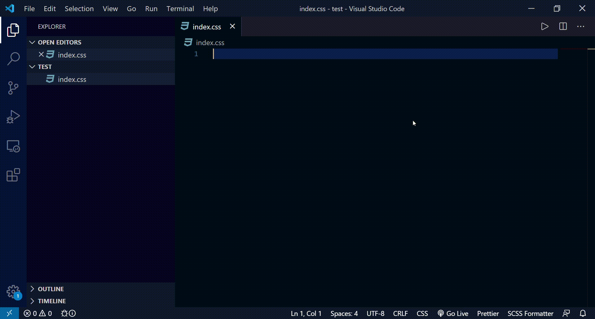

# css-code-snippet README

This is a css reset code snippet extension. Reset code is inspired by minified.css.
## Features

## Requirements

If you have any requirements or dependencies, add a section describing those and how to install and configure them.

## Extension Settings
Just install the extension.
Type "!css" in the (anyfilename).css file and use it.

## Release Notes

### 1.0.0

This is the initial release of CSS code snippet

**Enjoy!**
